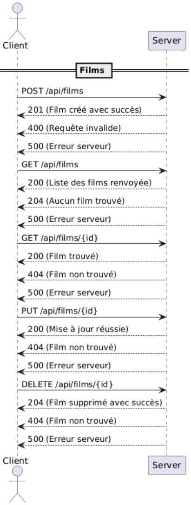
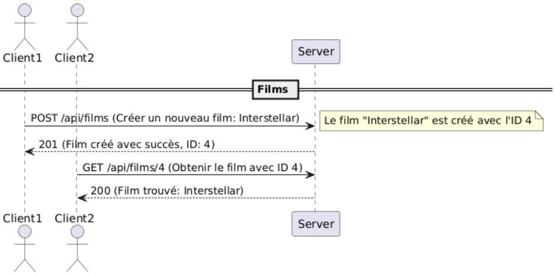
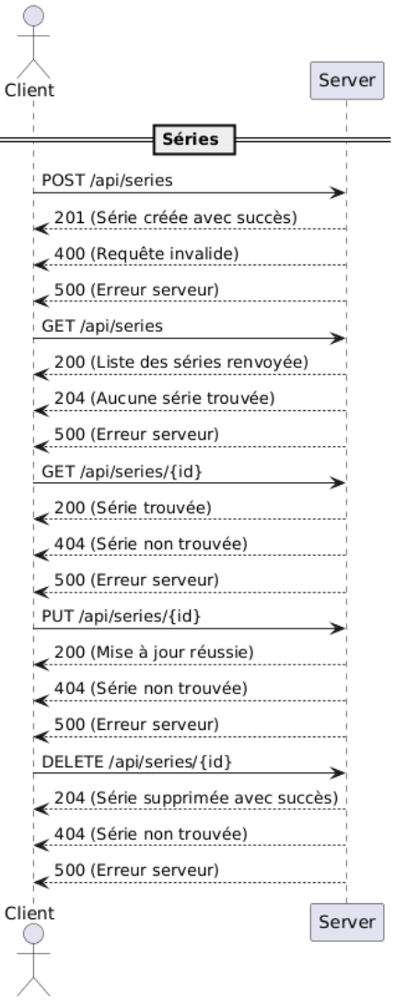

# ImdbLike API

L'API ImdbLike permet de gérer les films et les séries disponibles dans la base de données ImdbLike. Elle utilise le protocole HTTP sur le port 8080.

Le format JSON est utilisé pour échanger des données. L'en-tête `Content-Type` doit être défini sur `application/json` lors de l'envoi de données à l'API. L'en-tête `Accept` doit être défini sur `application/json` lors de la réception de données de l'API.

L'API est basée sur le modèle CRUD. Elle propose les opérations suivantes :

- Créer un nouveau film ou une nouvelle série
- Obtenir plusieurs films ou séries
- Obtenir un film ou une série par son ID
- Mettre à jour un film ou une série
- Supprimer un film ou une série

## Endpoints

### Films

#### Créer un nouveau film

**POST** `/api/films`

Créer un nouveau film.

**Request**

Le corps de la requête doit contenir un objet JSON avec les propriétés suivantes :

- `titre` - Le titre du film
- `date` - La date de sortie du film (format `yyyy-MM-dd`)
- `genre` - Le genre du film
- `synopsis` - Le synopsis du film
- `duree` - La durée du film (en minutes)

**Response**

Le corps de la réponse contient un objet JSON avec les propriétés suivantes :

- `id` - L'identifiant unique du film
- `titre` - Le titre du film
- `date` - La date de sortie du film
- `genre` - Le genre du film
- `synopsis` - Le synopsis du film
- `duree` - La durée du film

**Status codes**

- `201 (Created)` - Le film a été créé avec succès
- `400 (Bad Request)` - Le corps de la requête est invalide
- `500 (Internal Server Error)` - Une erreur interne du serveur s'est produite

#### Obtenir tous les films

**GET** `/api/films`

Obtenir tous les films.

**Response**

Le corps de la réponse contient un tableau JSON d'objets film.

**Status codes**

- `200 (OK)` - La requête a réussi
- `204 (No Content)` - Aucun film trouvé
- `500 (Internal Server Error)` - Une erreur interne du serveur s'est produite

#### Obtenir un film par ID

**GET** `/api/films/{id}`

Obtenir un film par son ID.

**Response**

Le corps de la réponse contient un objet JSON avec les propriétés du film.

**Status codes**

- `200 (OK)` - La requête a réussi
- `404 (Not Found)` - Le film avec l'ID spécifié n'a pas été trouvé
- `500 (Internal Server Error)` - Une erreur interne du serveur s'est produite

#### Mettre à jour un film

**PUT** `/api/films/{id}`

Mettre à jour un film.

**Request**

Le corps de la requête doit contenir un objet JSON avec les propriétés suivantes :

- `titre` - Le titre du film
- `date` - La date de sortie du film (format `yyyy-MM-dd`)
- `genre` - Le genre du film
- `synopsis` - Le synopsis du film
- `duree` - La durée du film (en minutes)

**Response**

Le corps de la réponse contient un objet JSON avec les propriétés mises à jour du film.

**Status codes**

- `200 (OK)` - La mise à jour a réussi
- `404 (Not Found)` - Le film avec l'ID spécifié n'a pas été trouvé
- `500 (Internal Server Error)` - Une erreur interne du serveur s'est produite

#### Supprimer un film

**DELETE** `/api/films/{id}`

Supprimer un film.

**Status codes**

- `204 (No Content)` - Le film a été supprimé avec succès
- `404 (Not Found)` - Le film avec l'ID spécifié n'a pas été trouvé
- `500 (Internal Server Error)` - Une erreur interne du serveur s'est produite

### Séries

#### Créer une nouvelle série

**POST** `/api/series`

Créer une nouvelle série.

**Request**

Le corps de la requête doit contenir un objet JSON avec les propriétés suivantes :

- `titre` - Le titre de la série
- `date` - La date de sortie de la série (format `yyyy-MM-dd`)
- `genre` - Le genre de la série

**Response**

Le corps de la réponse contient un objet JSON avec les propriétés suivantes :

- `id` - L'identifiant unique de la série
- `titre` - Le titre de la série
- `date` - La date de sortie de la série
- `genre` - Le genre de la série

**Status codes**

- `201 (Created)` - La série a été créée avec succès
- `400 (Bad Request)` - Le corps de la requête est invalide
- `500 (Internal Server Error)` - Une erreur interne du serveur s'est produite

#### Obtenir toutes les séries

**GET** `/api/series`

Obtenir toutes les séries.

**Response**

Le corps de la réponse contient un tableau JSON d'objets série.

**Status codes**

- `200 (OK)` - La requête a réussi
- `204 (No Content)` - Aucune série trouvée
- `500 (Internal Server Error)` - Une erreur interne du serveur s'est produite

#### Obtenir une série par ID

**GET** `/api/series/{id}`

Obtenir une série par son ID.

**Response**

Le corps de la réponse contient un objet JSON avec les propriétés de la série.

**Status codes**

- `200 (OK)` - La requête a réussi
- `404 (Not Found)` - La série avec l'ID spécifié n'a pas été trouvée
- `500 (Internal Server Error)` - Une erreur interne du serveur s'est produite

#### Mettre à jour une série

**PUT** `/api/series/{id}`

Mettre à jour une série.

**Request**

Le corps de la requête doit contenir un objet JSON avec les propriétés suivantes :

- `titre` - Le titre de la série
- `date` - La date de sortie de la série (format `yyyy-MM-dd`)
- `genre` - Le genre de la série

**Response**

Le corps de la réponse contient un objet JSON avec les propriétés mises à jour de la série.

**Status codes**

- `200 (OK)` - La mise à jour a réussi
- `404 (Not Found)` - La série avec l'ID spécifié n'a pas été trouvée
- `500 (Internal Server Error)` - Une erreur interne du serveur s'est produite

#### Supprimer une série

**DELETE** `/api/series/{id}`

Supprimer une série.

**Status codes**

- `204 (No Content)` - La série a été supprimée avec succès
- `404 (Not Found)` - La série avec l'ID spécifié n'a pas été trouvée
- `500 (Internal Server Error)` - Une erreur interne du serveur s'est produitemdbLike

## Examples

### Exemple films :

### Exemple series :

